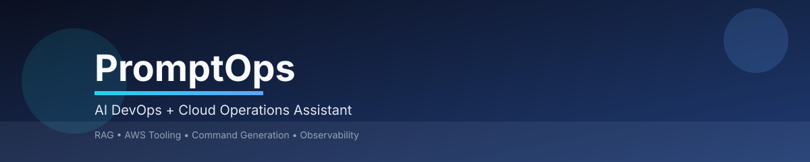
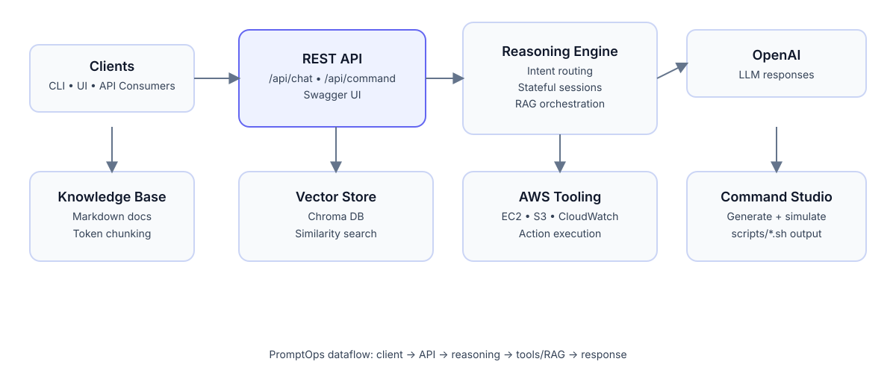

# PromptOps

<p align="center">
  
</p>

<p align="center">
  <strong>PromptOps</strong> (codename: <em>DevOpsGPT</em>) is a Spring Boot + Spring AI service that delivers
  a production-grade DevOps assistant with RAG, AWS tool execution, and command generation.
</p>

<p align="center">
  
  
  
  
</p>

---

## Table of Contents
- [Overview](#overview)
- [Key Capabilities](#key-capabilities)
- [Architecture](#architecture)
- [Tech Stack](#tech-stack)
- [Getting Started](#getting-started)
  - [Prerequisites](#prerequisites)
  - [Install & Run](#install--run)
  - [Configuration](#configuration)
- [API Reference](#api-reference)
- [RAG Knowledge Base](#rag-knowledge-base)
- [Operations & Observability](#operations--observability)
- [Security Notes](#security-notes)
- [Contributing](#contributing)
- [License](#license)

---

## Overview
PromptOps provides an AI-powered DevOps assistant that can:
- Answer DevOps and cloud questions with Retrieval-Augmented Generation (RAG)
- Generate shell commands from natural language
- Execute AWS operational actions (EC2, S3, CloudWatch) based on detected intent
- Maintain conversational context per session

The service exposes REST APIs under `/api` and ships with Swagger UI for discovery.

---

## Key Capabilities
- **Standard Chat**: LLM-backed (currently mocked) responses for quick interactions.
- **RAG Chat**: Pulls relevant knowledge base documents from a Chroma vector store.
- **Advanced Chat**: Stateful conversation + intent routing to AWS tools or command generation.
- **Command Generation**: Produces structured command + explanation output.
- **Command Simulation**: Creates mock execution logs and stores scripts on disk.
- **OpenAPI Docs**: Swagger UI available at `/swagger-ui.html`.

---

## Architecture
<p align="center">
  
</p>

**Flow summary**
1. Client sends chat/command requests to the REST API.
2. The reasoning engine routes requests:
   - RAG pipeline for general DevOps questions
   - AWS tools for operational intents (EC2/S3/CloudWatch)
   - Command generation for automation tasks
3. Vector store retrieves context from documents in `src/main/resources/documents`.
4. Responses are returned with optional source documents.

---

## Tech Stack
- **Java 25**
- **Spring Boot 3.3.x**
- **Spring AI (OpenAI + Chroma)**
- **AWS SDK v2 (EC2, S3, CloudWatch)**
- **SpringDoc OpenAPI / Swagger UI**

---

## Getting Started

### Prerequisites
- **Java 25** (required by Maven compiler settings)
- **Maven 3.9+**
- **OpenAI API key**
- **AWS credentials** (for AWS tool execution)
- **Chroma DB** (vector store endpoint)

### Install & Run
```bash
git clone https://github.com/jatinhati/PromptOps.git
cd PromptOps
mvn clean install
mvn spring-boot:run
```

The service starts on `http://localhost:8080`.

### Configuration
Runtime configuration is defined in `src/main/resources/application.yml`. Use environment variables to override:

| Variable | Purpose | Example |
| --- | --- | --- |
| `OPENAI_API_KEY` | OpenAI API key for Spring AI | `sk-...` |
| `AWS_Region` | AWS region used by AWS SDK | `us-east-1` |
| `SPRING_AI_VECTOR_STORE_CHROMA_CLIENT_HOST` | Chroma host | `http://localhost` |
| `SPRING_AI_VECTOR_STORE_CHROMA_CLIENT_PORT` | Chroma port | `8000` |

> The AWS SDK also respects the default credential provider chain (env vars, profiles, IAM roles).

---

## API Reference
Base URL: `http://localhost:8080/api`

### Health
`GET /ping`

### Standard Chat
`POST /chat`
```json
{
  "sessionId": "demo-session",
  "message": "Explain Kubernetes pods"
}
```
Response:
```json
{
  "response": "...",
  "contextId": "demo-session"
}
```

### RAG Chat
`POST /chat/rag`
```json
{
  "sessionId": "demo-session",
  "message": "Explain S3 bucket policies"
}
```

### Advanced Chat
`POST /chat/advanced`
```json
{
  "sessionId": "demo-session",
  "message": "Start EC2 instance i-1234567890abcdef0"
}
```
Response:
```json
{
  "response": "✅ Action sent: EC2 instance ...",
  "sourceDocuments": [
    "devops-doc"
  ]
}
```

### Command Generation
`POST /command/generate`
```json
{
  "task": "Create a Docker image for a Node app"
}
```

### Command Simulation
`POST /command/simulate`
```json
{
  "command": "docker build -t myapp:latest ."
}
```

Swagger UI: `http://localhost:8080/swagger-ui.html`

---

## RAG Knowledge Base
Documents in `src/main/resources/documents/*.md` are ingested at startup by `VectorStoreIngestor`.
To add new knowledge:
1. Add markdown files to the documents folder.
2. Restart the application to trigger re-ingestion.

---

## Operations & Observability
- **Logs**: SLF4J logging to console by default.
- **Scripts output**: Command simulations write `scripts/*.sh` on the server.
- **CORS**: Enabled for `/api/**` (all origins allowed by default).

---

## Security Notes
- Never commit API keys. Use environment variables instead.
- Restrict network access to your Chroma DB and OpenAI credentials.
- Review CORS settings before production deployment.

---

## Contributing
1. Fork the repository.
2. Create a feature branch.
3. Submit a pull request with a clear description of changes.

---

## License
No license file is currently present in the repository. Add a `LICENSE` file to formalize usage terms.
